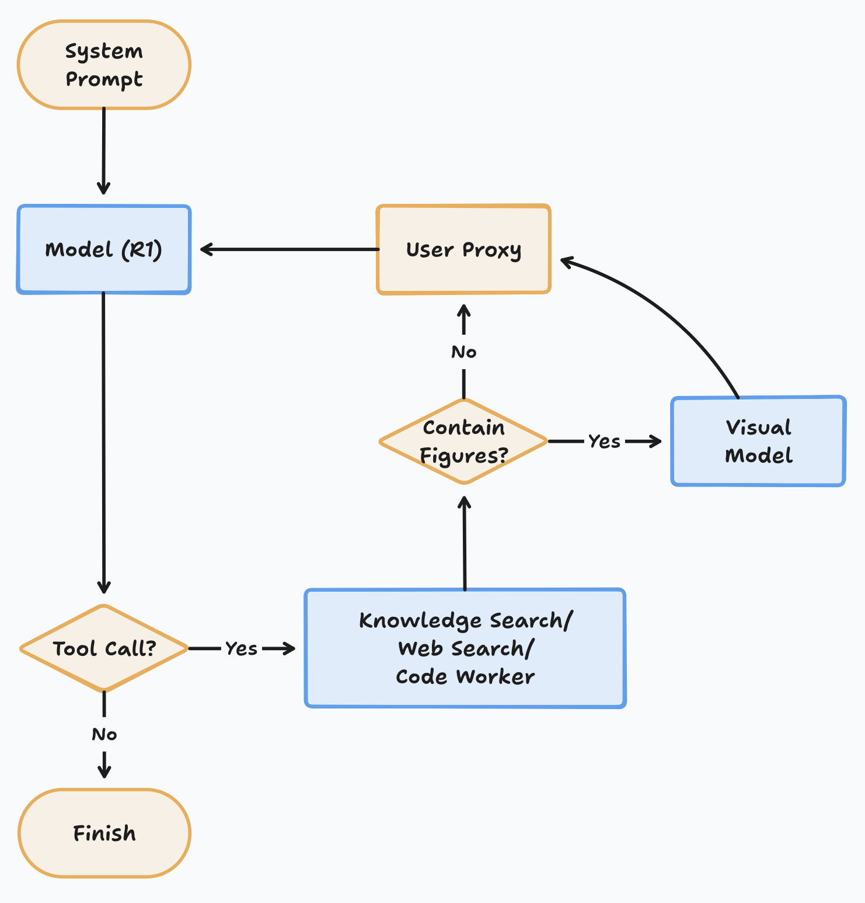

# WELT: Workflow-adaptivE LLM with Target-oriented system

Maybe can do simple high energy physics analysis

Video: [link](https://ihepbox.ihep.ac.cn/ihepbox/index.php/s/eyyWEdY0BTLp6UH)

`welt.py` is a [pipe function](https://docs.openwebui.com/features/plugin/functions/pipe/) of open-webui

But to use WELT, you need to monkey-patch open-webui like this: [commit](https://github.com/open-webui/open-webui/commit/bc79483b7bc6e85853eefef986afea7192041501)

